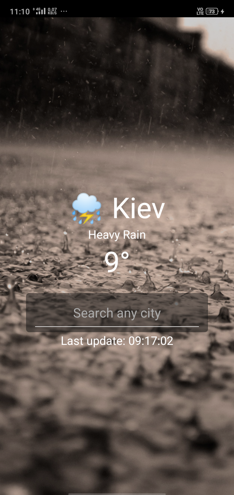

### This weather app is created using React Native for Android.

This basic app help to learn react native for beginners, if you are already familiar with React then it's easy
to get start with react native.
Only difference between React and React Native is JSX Syntax will be changed and some css styling part are
different. `div` are replaced with `View` and `p` tags with `Text` in react native.

